# 关于

验机盒子是对标市面上的机大侠、验机宝（沙漏验机）等不同场景下实现的验机硬件产品，同样也可二开为纯软件产品。当前场景实现硬件产品成本20几。

# 设计

因回收办单流程基于浏览器办理（第三方应用嵌入或第三方小程序等场景），办单员在浏览器中获取设备本地存储或蓝牙权限处理较复杂，故通过网络回传报告，验机设备将依赖网络传输，需配网操作。

验机设备应该具有安全、通用、持续维护等特性。

## 1\. 配网

通过手机连接验机设备为验机设备配网
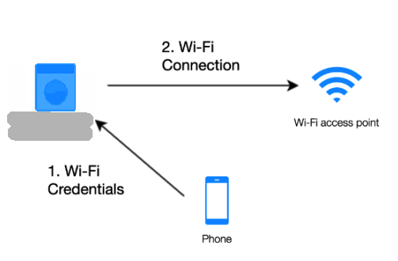

## 2\. 验机数据获取

通过回收设备与验机设备连接，验机设备读取回收设备数据通过网络传回服务器
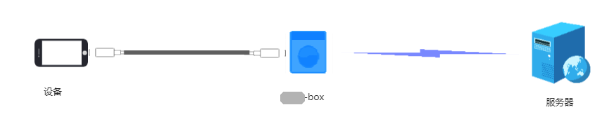

## 3\. 报告查看

通过接口访问服务器查看回收设备信息
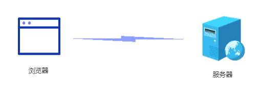

## 4\. 服务更新

基于数据沉淀，支持远程更新验机设备内的服务，便于持续优化
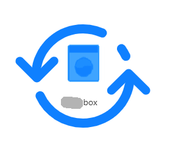

## 5\. 系统管理

支持验机设备远程系统管理，便于远程协助

# 实现

略

# 使用

## 第一步

第一次拿到设备需为验机设备配网或修改连接wifi信息（若已配网，则跳过本步），手机微信扫码下面二维码进入微信小程序

点击蓝牙快速配网
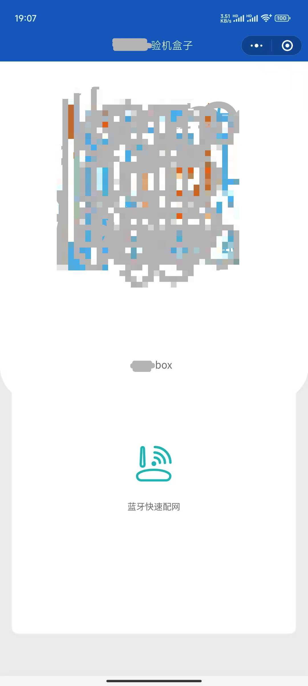

Blue扫描中选中XXX-box蓝牙设备（苹果设备需在设置-蓝牙-其他设备 中选择 XXX-box 进行免密连接）
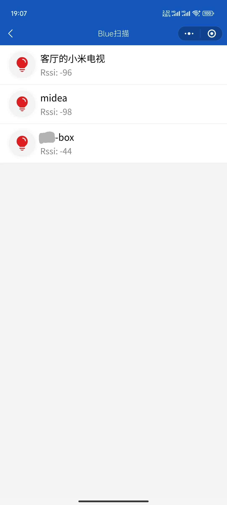

配网为当前手机已连WIFI，请输入WIFI密码
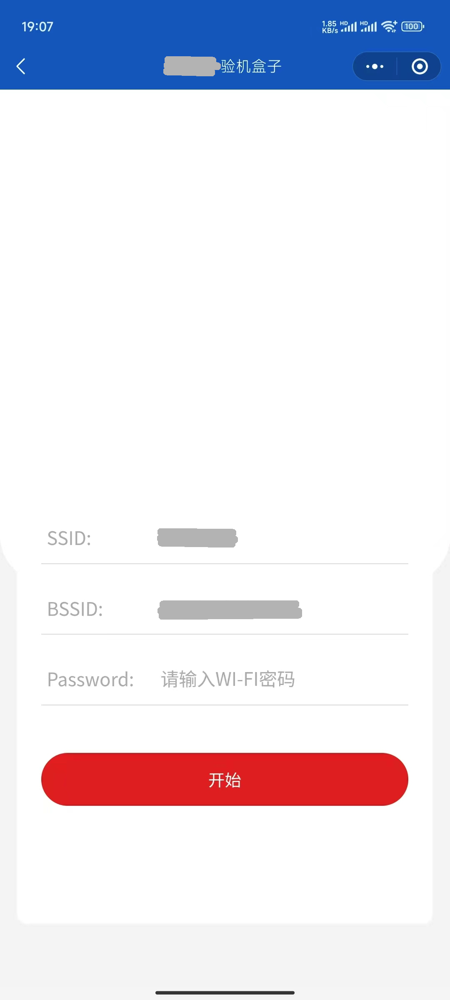

等待配网完成
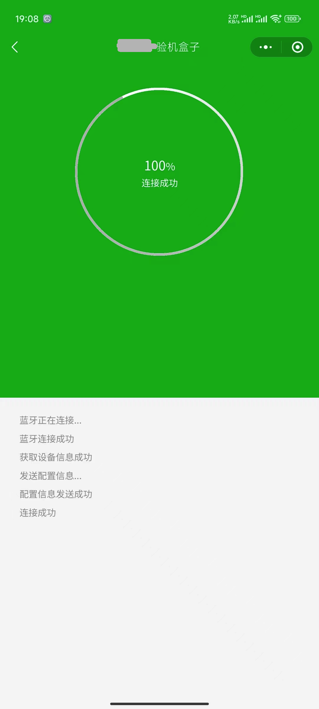

## 第二步

连接回收设备与验机设备后，选择信任
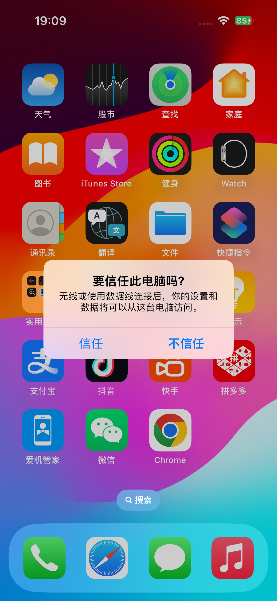

输入设备密码后等待完成
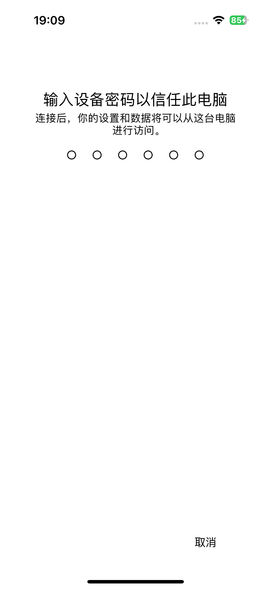

## 第三步

**演示环境** 扫描下方二维码打开网页，刷新查看第二步回收设备验机信息
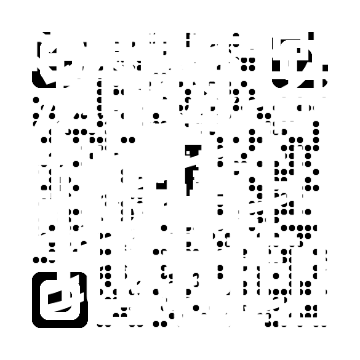

## 不同设备信息获取

## 对比

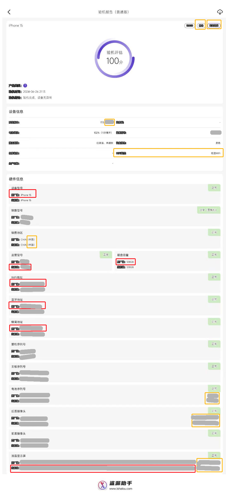

## 设备

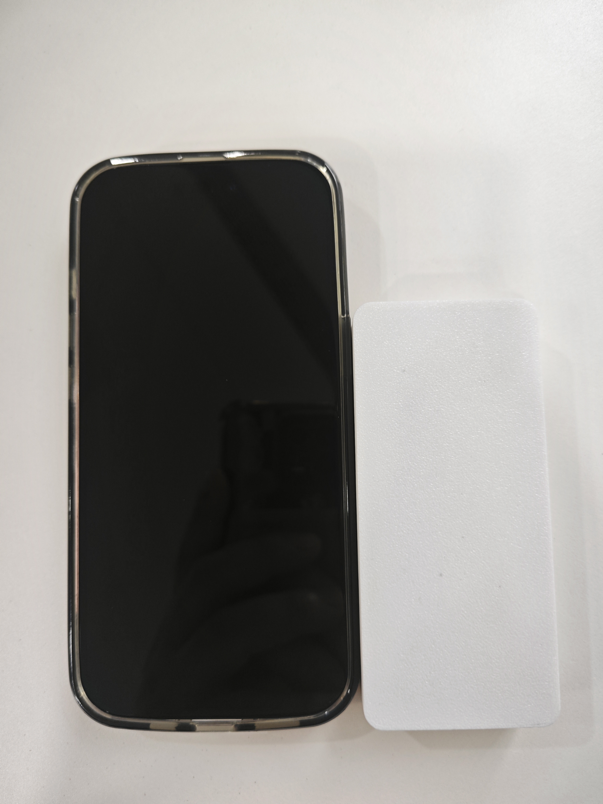

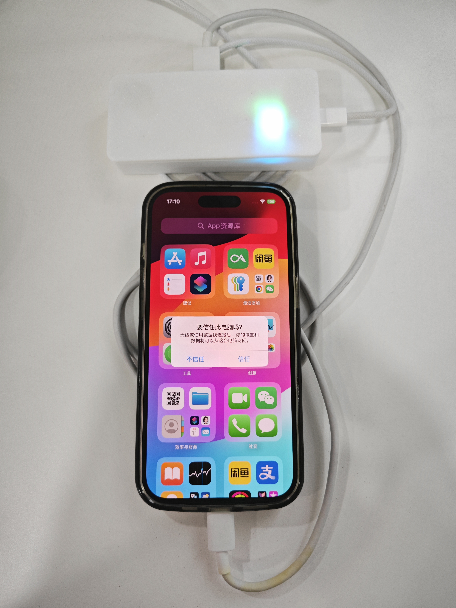

* * *

项目完成时间：2024年7月
